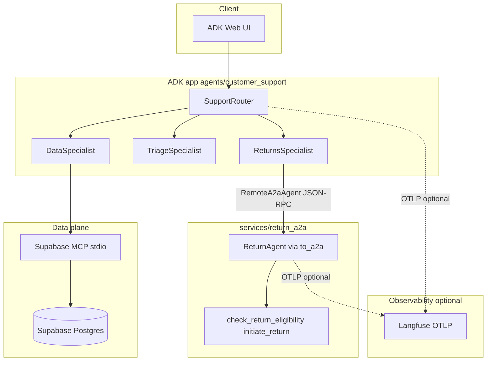

## Overview

A **multi-agent customer support** reference built with **Google ADK**. A single **router** agent delegates to specialists: one talks to **Supabase** through the **Model Context Protocol (MCP)** for live orders and tickets, another reaches a **returns workflow** exposed as a separate **Agent-to-Agent (A2A)** service (`to_a2a`), and a **triage** agent handles tone, policy, and **escalation** guidance without those backends. The database schema and seed data live in **Supabase migrations** so you can point the stack at a real hosted project. Optionally, **OpenTelemetry** spans can be exported to **[Langfuse](https://langfuse.com)** ([setup](agents/README.md#langfuse-observability)).

## Tech stack

| Area | Technologies |
|------|----------------|
| **Language & runtime** | Python 3 |
| **Agents & orchestration** | [Google ADK](https://github.com/google/adk-python) (`google-adk`), including **A2A** (`RemoteA2aAgent`, `to_a2a`) |
| **LLM** | [Google Gemini](https://ai.google.dev/) (default model `gemini-2.5-flash`, configurable via `ADK_MODEL`) |
| **Local config** | `python-dotenv` (`.env`) |
| **Return A2A service** | ADK `LlmAgent` + `to_a2a()` on a **Starlette** ASGI app, served with **Uvicorn** |
| **Data & migrations** | [Supabase](https://supabase.com/) (Postgres), [Supabase CLI](https://supabase.com/docs/guides/cli) for schema and seed |
| **Database access from agents** | [Model Context Protocol (MCP)](https://modelcontextprotocol.io/) — [`@supabase/mcp-server-supabase`](https://github.com/supabase/mcp-server-supabase) (requires **Node.js** / `npx`) |
| **Developer UI** | ADK Web UI (`adk web`) |
| **Testing & eval** | **pytest**, **pytest-asyncio**, **httpx**, **PyYAML** (see `requirements-dev.txt`) |
| **Observability (optional)** | **OpenTelemetry** (SDK + OTLP HTTP), **[Langfuse](https://langfuse.com)**, **openinference-instrumentation-google-genai** (see `requirements-observability.txt`) |

Runtime installs are split across [`requirements.txt`](requirements.txt), [`requirements-dev.txt`](requirements-dev.txt), and [`requirements-observability.txt`](requirements-observability.txt).

## Architecture

- **SupportRouter** uses LLM transfer to pick a specialist.
- **DataSpecialist** runs read-only SQL against your project through **`@supabase/mcp-server-supabase`**.
- **ReturnsSpecialist** is a **`RemoteA2aAgent`**; it calls the standalone **ReturnAgent** Starlette app (same repo) that implements return eligibility and initiation.
- **TriageSpecialist** covers qualitative support and human **escalation** paths when no DB or return tool is required.
- **Langfuse (optional):** when enabled, the main ADK app and the return A2A process can send OTLP traces to Langfuse (see [agents/README.md](agents/README.md#langfuse-observability)).

## Documentation

- **Database (schema, migrations, seed):** [supabase/README.md](supabase/README.md)
- **ADK agents (run, env, MCP, returns A2A, tests):** [agents/README.md](agents/README.md)
- **Return A2A service (`to_a2a`):** [services/README.md](services/README.md)
- **Langfuse / OpenTelemetry (optional):** [agents/README.md](agents/README.md#langfuse-observability), [observability/langfuse_otel.py](observability/langfuse_otel.py), `requirements-observability.txt`
- **Mini eval (YAML scenarios + scores):** [eval/README.md](eval/README.md) — see below

### Tests and evaluation

| What | How | When it runs |
|------|-----|----------------|
| **Integration scenarios** | `RUN_INTEGRATION_TESTS=1 pytest tests/test_support_scenarios.py -v` | Billing (MCP), returns (A2A), triage escalation; custom assertions. |
| **Mini eval** | `RUN_MINI_EVAL=1 pytest tests/test_mini_eval.py -v` **or** `python -m eval` | Same live deps as integration tests; scenarios in [`eval/scenarios.yaml`](eval/scenarios.yaml). |

**Mini eval** assigns a **binary score per rule** (0 or 1), a **weighted mean score per scenario**, and compares it to **`pass_threshold`** (default 1.0). Running **`python -m eval`** from the repo root prints a **PASS/FAIL/SKIP** report with **scores**, per-rule breakdown, **mean score** over non-skipped scenarios, and exits **0** only if every executed scenario passes. Optional: **`adk eval`** against an ADK EvalSet file (see [eval/README.md](eval/README.md)).

Install dev dependencies first: `pip install -r requirements-dev.txt` (includes **PyYAML** for scenarios). Optional shell flags are documented in [`.env.example`](.env.example) (`RUN_INTEGRATION_TESTS`, `RUN_MINI_EVAL`).
